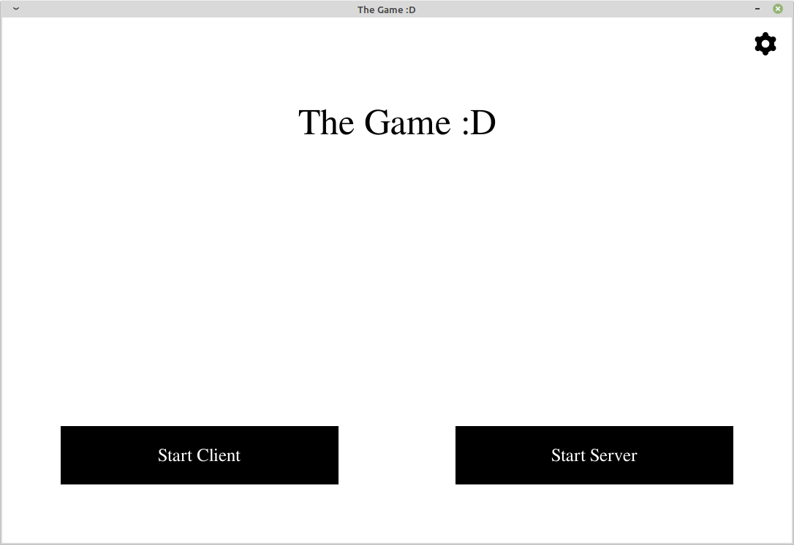
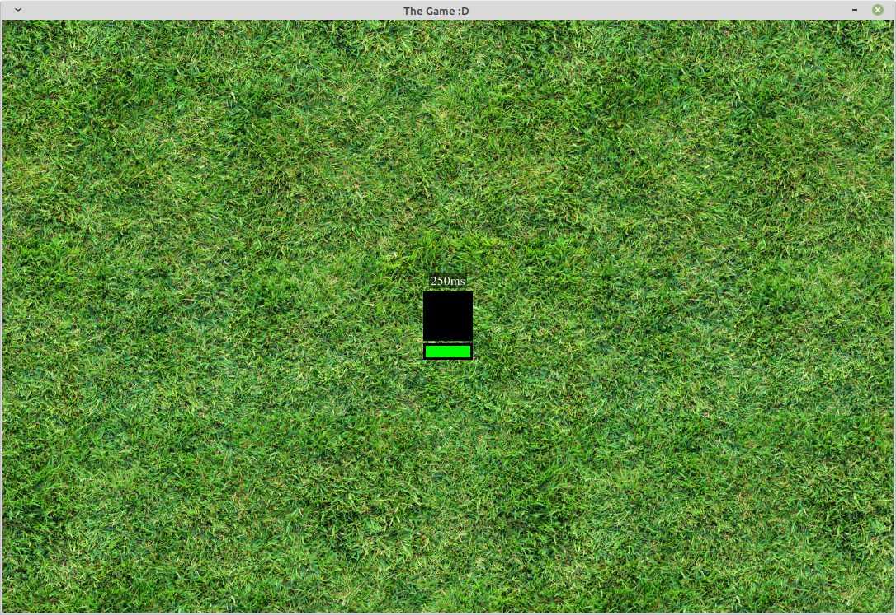

# Welcome to <span style=color:#ca03fc>Plucky Pooka's</span> 2022 Python Discord Code Jam Repository

## About
**`Flamin' Sockets`** is a 2D directional game written in Python. It uses [websockets.io](https://websockets.readthedocs.io/en/stable/) to allow for multiple client connections and [asyncio](https://docs.python.org/3/library/asyncio.html) to handle concurrent functionality.



The game showcases the use of websockets to transmit information back and forth via a `client <--> server <--> client` interaction.

Example output:
```
No active connections.
ConnectionClosed.
<websockets.legacy.server.WebSocketServerProtocol object at 0x7fd06bd93130>
Connection from 063a8414-850d-4bda-a323-2350d96a5f23 received.
Active connections: 1
ClientHandler 063a8414-850d-4bda-a323-2350d96a5f23 disconnected.
No active connections.
ConnectionClosed.
<websockets.legacy.server.WebSocketServerProtocol object at 0x7fd06bd93190>
Connection from 4b873e29-9cb3-4b68-a237-54e5c24cf2f9 received.
Active connections: 1
<websockets.legacy.server.WebSocketServerProtocol object at 0x7fd06bd92c20>
Connection from 529c53cf-a605-4140-90aa-efc9c7d26566 received.
Active connections: 2
ClientHandler 529c53cf-a605-4140-90aa-efc9c7d26566 disconnected.
Active connections: 1
ConnectionClosed.
ClientHandler 4b873e29-9cb3-4b68-a237-54e5c24cf2f9 disconnected.
No active connections.
ClientHandler 4b873e29-9cb3-4b68-a237-54e5c24cf2f9 disconnected.
...
...
...
```

## How to Run
*All snippets have to run from within project root directory.*

1. Run `pipenv install -r dev.requirement.txt` to install dependencies.

2. To activate the virtual environment, run ```pipenv shell```.

3. Run the following to start the server: ```python ./server/server_handler.py```.

4. Once the server starts, run the following to start a client: ```python main.py```.

5. You will be presented with a screen displaying the default ip address of the server. This is currently `port 8765` on `127.0.0.1` / `localhost`.

    Currently *not implemented*. See future development goals below.

6. You can use your directional keys to control movement and see data getting transmitted through the active websocket connection.

7. Use the LEFT mouse button for a flameshot attack. **Enjoy!**



## Plucky Pooka Team Members
Krishy Fishy | MyApaulogies | rami.alloush | Pixler | gvsa123

## Future Development
As part of the challenge, we wanted to focus on getting the functionality of the required technologies working before implementing more advanced game-related functionality and features. Below is an outline of what we would like to continue working on:

1. Implement menu functionality.
2. Use ping attacks to slow the movement of another player allowing others to fire more aggressive weapons.
3. Multiplayer LAN functionality.
